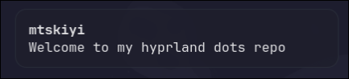

# Hyprland Dotfiles

My personal Arch Linux Hyprland dotfiles.

These configs are made for my own setup. Some paths, monitor settings, keyboard layout, and wallpapers may need editing.

## Screenshots

<p align="center">
  
  
</p>

<p align="center">
  
  
</p>

## Setup

- OS: Arch Linux
- WM: Hyprland
- Bar: Waybar
- Launcher: Rofi
- Terminal: Kitty
- Shell: Fish
- Notifications: Dunst
- File manager: Ranger
- Fetch: Fastfetch

## Structure

```txt
.config/
├── hypr/
├── waybar/
├── rofi/
├── kitty/
├── dunst/
├── fish/
├── fastfetch/
├── ranger/
├── gtk-3.0/
└── gtk-4.0/

Wallpapers/
screenshots/
```

## Required packages

Install these packages before copying the dotfiles.

### Official Arch packages

```bash
sudo pacman -Syu --needed \
  git \
  hyprland xdg-desktop-portal-hyprland hyprshutdown \
  waybar rofi kitty dunst fish fastfetch ranger \
  swaybg \
  grim slurp wl-clipboard hyprpicker \
  brightnessctl playerctl pavucontrol \
  wireplumber \
  bluetui \
  eza \
  papirus-icon-theme adw-gtk-theme
```

### AUR packages

These are needed for the exact font and Qt theme used by the configs.

```bash
yay -S --needed ttf-google-sans-code-nf hyprqt6engine
```

If you use `paru` instead of `yay`:

```bash
paru -S --needed ttf-google-sans-code-nf hyprqt6engine
```

## Enable services

```bash
sudo systemctl enable --now NetworkManager
sudo systemctl enable --now bluetooth
```

## Install

```bash
git clone https://github.com/mtskiyi/hyprland-dotfiles.git
cd hyprland-dotfiles

mkdir -p ~/.config
cp -r .config/* ~/.config/

mkdir -p ~/Wallpapers
cp Wallpapers/wallpaper.png ~/Wallpapers/wallpaper.png
```

## Optional: set Fish as default shell

```bash
chsh -s /usr/bin/fish
```

Log out and log back in after changing shell.

## Notes

- These configs use Hyprland Lua-style config files.
- Wallpaper is copied as `~/Wallpapers/wallpaper.png` because the Hyprland config uses that path.
- Keyboard layout is set to `us` by default. Change it in `.config/hypr/hyprland/general.lua` if needed.
- Some configs are made for my personal setup, so edit paths and settings if something does not match your system.
